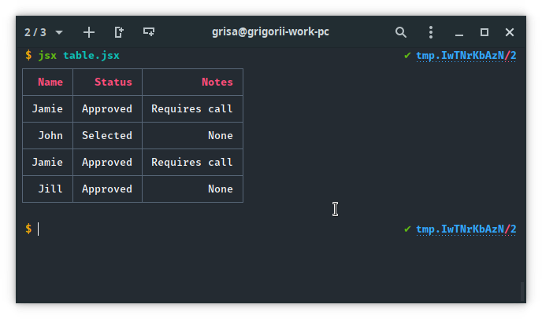
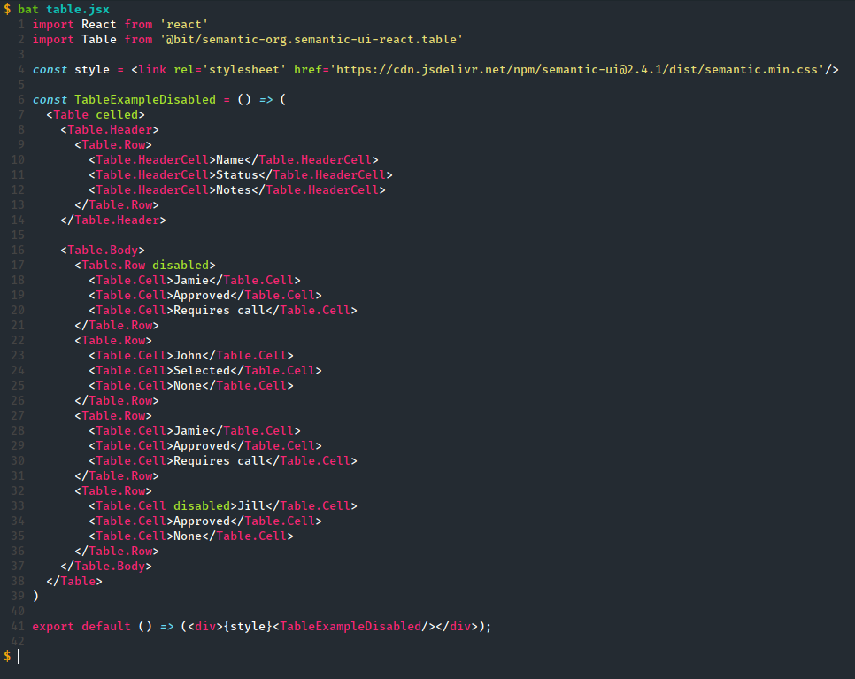

Welcome to cli-jsx
===


[](https://github.com/horosgrisa/cli-jsx#readme)
[](https://github.com/horosgrisa/cli-jsx/graphs/commit-activity)
[](https://github.com/horosgrisa/cli-jsx/blob/master/LICENSE)


> Renderer JSX in the Terminal.  
> Supports pretty tables and syntax highlighting


## Install

```sh
npm i -g cli-jsx
```

## Example

```sh
jsx demo.jsx
```

This will produce the following:






## Usage as module

```sh
npm i cli-jsx
```

```js
const cliJSX = require('cli-jsx');

const jsx = <h1>Hello World</h1>

console.log(cliJSX(jsx));
```

## Run tests

```sh
npm run test
```

## Author

👤**Grigorii Horos**

* Github: [@horosgrisa](https://github.com/horosgrisa)

## Contributing

Contributions, issues and feature requests are welcome!

Feel free to check [issues page](https://github.com/horosgrisa/cli-jsx/issues).

## Show your support

Give a ⭐️ if this project helped you!


## License

Copyright © 2019 [Grigorii Horos](https://github.com/horosgrisa).

This project is [GPL-3.0-or-later](https://github.com/horosgrisa/cli-jsx/blob/master/LICENSE) licensed.

