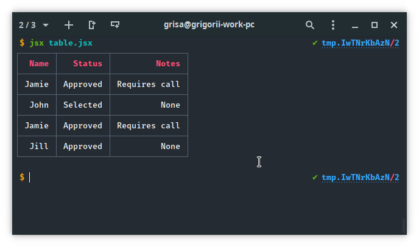
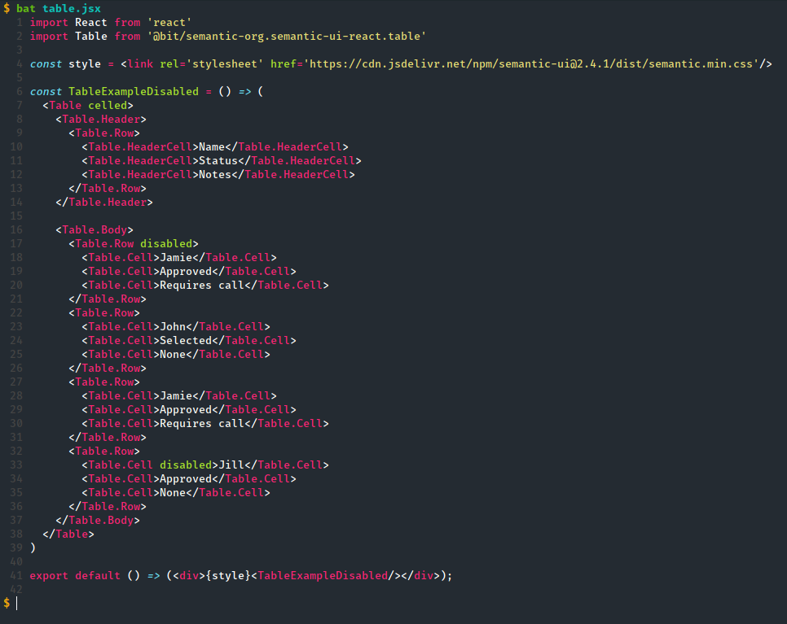

Welcome to cli-jsx
===


[](https://github.com/horosgrisa/cli-jsx#readme)
[](https://github.com/horosgrisa/cli-jsx/graphs/commit-activity)
[](https://github.com/horosgrisa/cli-jsx/blob/master/LICENSE)


> Renderer JSX in the Terminal.  
> Supports pretty tables and syntax highlighting


> As of v2, `cli-jsx` is a thin wrapper around [`cli-html`](https://github.com/grigorii-horos/cli-html).
> The implementation (the `jsx` command and `renderJSX`) lives in `cli-html`;
> this package just re-exports it. Use `cli-html` directly if you prefer.

## Install

```sh
npm i -g cli-jsx
```

## Example

```sh
jsx demo.jsx
```

This will produce the following:






## Usage as module

```sh
npm i cli-jsx
```

`renderJSX` is async (react/react-dom are loaded lazily) and renders straight to
the terminal:

```js
import renderJSX from 'cli-jsx';

const App = () => <h1>Hello World</h1>;

console.log(await renderJSX(<App />));
```

## Run tests

```sh
npm run test
```

## Author

👤**Grigorii Horos**

* Github: [@horosgrisa](https://github.com/horosgrisa)

## Contributing

Contributions, issues and feature requests are welcome!

Feel free to check [issues page](https://github.com/horosgrisa/cli-jsx/issues).

## Show your support

Give a ⭐️ if this project helped you!


## License

Copyright © 2019 [Grigorii Horos](https://github.com/horosgrisa).

This project is [GPL-3.0-or-later](https://github.com/horosgrisa/cli-jsx/blob/master/LICENSE) licensed.

